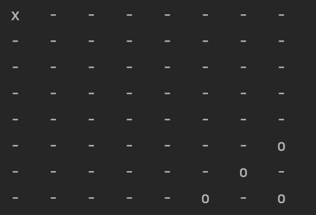

## Board Game

FBoard is a class for playing a game where a player X is trying to get a piece to the
right bottom corner of a square board, and a player O is trying to make it so player X doesn't have
any legal moves.

### Structure

    fboard.py                      actual main class
    
    config
    ├── board_config.py             data for initialize the board class 
    ├── board_error.py              error classes to handle exceptions
    └── game_state.py               enum for the game states

    tests
    ├── board_validator_test.py     tests for the validators
    ├── fboard_test.py              tests for the board class
    └── data
        ├── valid_config.py          dataset for testing config 
        └── valid_move.py            dataset for testing moves

    utils
    └── board_validator.py           helper class for validating data

### Example of the board



### Notes

To run test

```
python -m unittest tests/board_validator_test.py
python -m unittest tests/fboard_test.py
```
